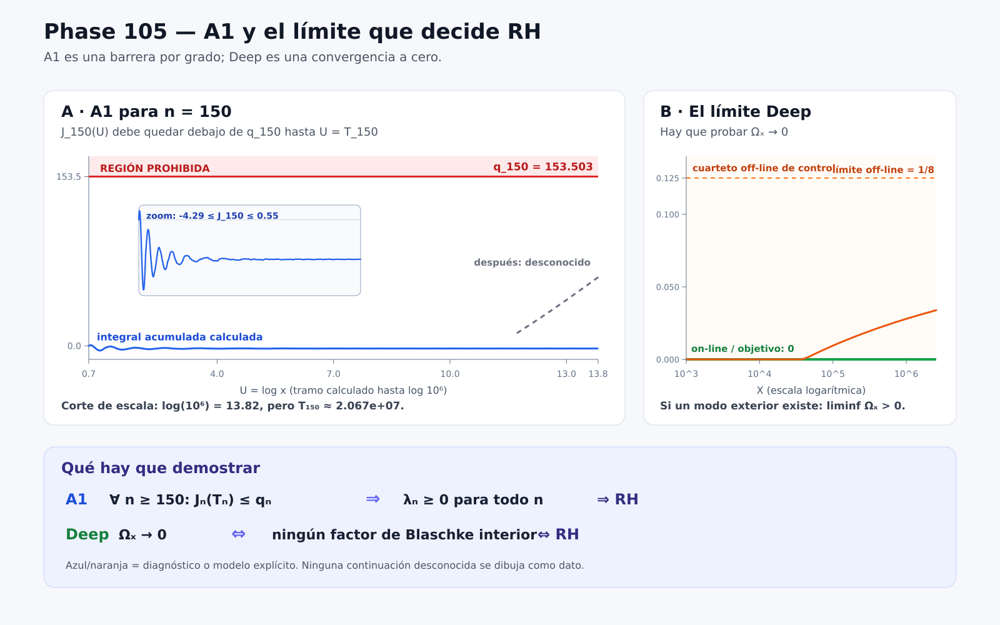

# 105_00 — Mapa visual de A1 y del límite Deep

## 1. Qué muestra el panel A

Para un índice fijo,

\[
 J_n(U)=\int_{\log2}^{U}
 (\psi(e^u)-e^u)e^{-u}L_{n-1}^{(2)}(u)\,du,               \tag{1}
\]

y

\[
 q_n={3\over4}A_n+1-L_n^{(1)}(\log2).                    \tag{2}
\]

A1 dice

\[
 \boxed{J_n(T_n)\le q_n\quad\hbox{para cada }n\ge150.}  \tag{3}
\]

La figura usa (n=150). La curva azul es un cálculo directo de (1) en
el tramo

\[
 \log2\le U\le\log(10^6),                                \tag{4}
\]

usando (\psi(x)) exacta mediante todas las potencias primas hasta
(10^6). La línea roja es la barrera exacta (q_{150}). La zona roja es
la región prohibida.

El cutoff efectivo declarado es aproximadamente

\[
 T_{150}(1/4)=2.0669596\times10^7.                        \tag{5}
\]

Por eso la figura corta el eje: (4) es una fracción minúscula del camino
hasta (5). La continuación gris no son datos ni una predicción. Representa
la parte que una demostración debe controlar. La observación de que la
curva inicial está lejos de la barrera no prueba A1.

## 2. Qué muestra el panel B

Con (H_X=\sum_{n\le X}1/n), defina

\[
 \Omega_X={1\over H_X}\sum_{n\le X}{1\over n}
 \mathbf1_{\{\lambda_n+\log(n+1)\le-e^{\sqrt X}\}}.      \tag{6}
\]

El límite que debe demostrarse para los primos ordinarios es

\[
 \boxed{\Omega_X\to0.}                                   \tag{7}
\]

La línea verde muestra el comportamiento teórico on-line: una vez que
todos los ceros están en la línea, el evento profundo desaparece. La curva
naranja no corresponde a ζ: es el cuarteto exterior racional de control
con (R=201/200). Su densidad logarítmica se aproxima a (1/8). Sirve para
mostrar gráficamente lo que produciría un modo exterior: el observable no
convergería a cero.

## 3. Relación entre ambos paneles

\[
 \mathrm{A1}\Longrightarrow
 \lambda_n\ge0\ (n\ge1)\Longrightarrow
 \mathrm{RH}\Longrightarrow
 \Omega_X\to0.                                           \tag{8}
\]

También está probado directamente que (\Omega_X\to0\iff\mathrm{RH}).
Por tanto los paneles son dos coordenadas del mismo muro lógico, pero no
son la misma cantidad:

* A1 exige que ninguna curva (J_n) cruce su barrera en el cutoff;
* Deep exige que la proporción logarítmica de excursiones negativas
  profundas tienda a cero.

## 4. Qué es dato y qué es esquema

| Elemento | Estado |
|---|---|
| curva azul de A1 hasta (10^6) | cálculo directo en doble precisión; diagnóstico |
| (q_{150}), (A_{150}), (T_{150}) | fórmulas declaradas evaluadas numéricamente |
| continuación gris hasta (T_{150}) | región desconocida, no dato |
| línea verde (\Omega_X=0) | escenario on-line del teorema |
| curva naranja hacia (1/8) | contra-modelo exterior explícito, no ζ |
| A1 y (\Omega_X\to0) para primos ordinarios | abiertos |

