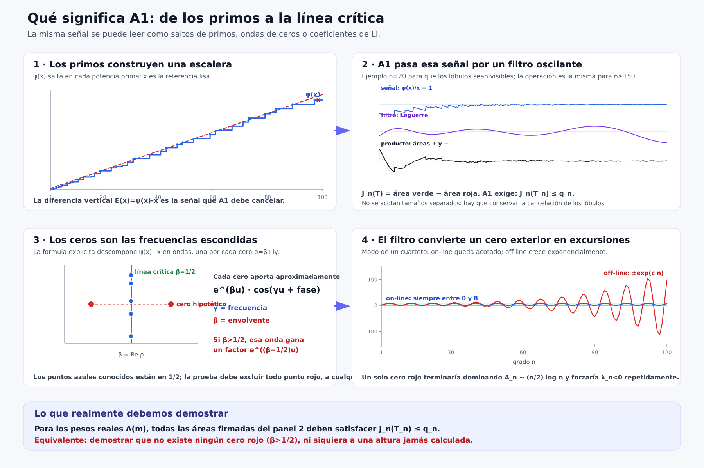

# 105_01 — From primes to A1 and from A1 to zeros

## Plain-language reading

### 1. The primes produce a signal

The function \(\psi(x)\) is a staircase: it jumps at every prime power
\(p^k\), with jump size \(\log p\). The line \(x\) is its expected smooth
trend. Their difference

\[
 E(x)=\psi(x)-x                                             \tag{1}
\]

is the arithmetic oscillation that must be controlled.

### 2. A1 measures a signed area

After writing \(x=e^u\), A1 multiplies this signal by a Laguerre filter:

\[
 J_n(T)=\int_{\log2}^{T}
 {\psi(e^u)-e^u\over e^u}L_{n-1}^{(2)}(u)\,du.             \tag{2}
\]

The Laguerre polynomial changes sign many times. Thus (2) is positive area
minus negative area. The target is

\[
 \boxed{J_n(T_n)\le q_n\quad\text{for every }n\ge150.}    \tag{3}
\]

The integrand need not have one sign. The final signed sum must remain below
the barrier.

### 3. The zeros are the frequencies of that signal

Schematically, the explicit formula writes

\[
 \psi(e^u)-e^u
 \simeq-\sum_\rho {e^{\rho u}\over\rho}+\text{boundary terms}. \tag{4}
\]

If \(\rho=\beta+i\gamma\), then

* \(\gamma\) determines the oscillation frequency;
* \(\beta\) determines the size of its envelope.

Zeros with \(\beta=1/2\) produce waves at the critical scale. A zero with
\(\beta>1/2\) produces a wave amplified relative to that scale by

\[
 e^{(\beta-1/2)u}.                                        \tag{5}
\]

### 4. Why an off-line zero creates an exponential mode

Set

\[
 w_\rho=1-{1\over\rho}.
\]

On the critical line, \(|w_\rho|=1\), so the symmetric mode is bounded. Off
the line, one member of the functional-equation orbit has transformed modulus
strictly smaller than one, and its reciprocal has modulus strictly larger
than one. Their exact quartet contribution is derived in
105_02_OFF_LINE_ZERO_EXPONENTIAL_THEOREM.md.

## The missing statement

The figure identifies what a proof must establish but is not itself a proof.
The computed zeros may all lie on the critical line while an unknown zero at
greater height remains possible. One must prove either

1. directly from the ordinary prime weights that (3) holds for every \(n\); or
2. directly from the completed zeta function that no zero has
   \(\beta>1/2\).

The first statement is A1; the second is RH. The exact bridge is already
available. The remaining task is to exclude the red point.

## What is data in the figure

* The \(\psi(x)\) staircase uses the actual primes and prime powers up to
  \(100\).
* The Laguerre panel uses the actual \(\psi\) up to \(5000\), with \(n=20\)
  solely to make the lobes visible.
* The blue points use the first known zero ordinates as an illustration.
* The red point and exponential curve are a hypothetical counter-scenario,
  not an observed zero of \(\zeta\).
